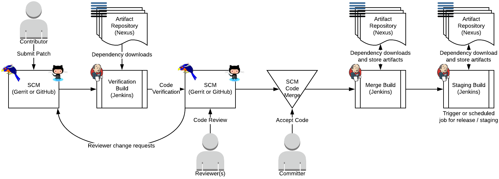
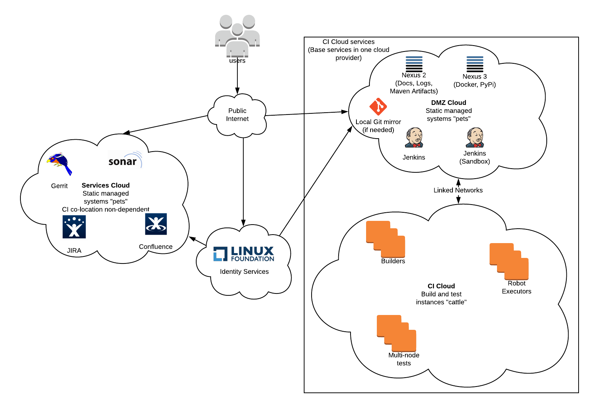

.. _lfreleng-docs-environment-overview:

####################
Environment Overview
####################

Projects coming to The Linux Foundation (LF) for Continuous Integregration (CI)
services are generally given a similar infrastructure to the rest of our other
projects unless there is a good reason to deviate from this configuration.

This infrastructure enables the developers to all have similar workflows which
makes it possible for the communities to help each other out with how to work in
environment. The development workflow enabled is in Figure 1.

   Figure 1

The standard infrastructure configuration that we build for projects is in
Figure 2.

   Figure 2

This design is so that services can be logically separated and moved around to
different cloud providers based upon the needs of the project as well as costs
related to operating in given clouds.

The basic configuration puts our CI systems along with artifact storage into a
special DMZ Cloud which is where communities interact with the CI infrastructure
itself. This cloud is then linked to a private dynamic instance cloud that has
the ability to access the DMZ resources and external internet services, but not
anything deeper into the core LF networks.

Services that are not dependent on being co-located with the CI infrastructure
will be in a different cloud. While this cloud, may be with the same provider,
it may be a different provider. We do this to ensure that the CI build
infrastructure itself has as little capability of potentially jail breaking /
exploiting potential security issues in the code repository hosting in
particular but also any other services hosted in the infrastructure.

Pre-formation
=============

When services for a project are first being setup, the project will be in a
pre-formation phase. During this phase most services allow a non-public,
restricted set of people, access the resources.

Pre-formation participants will receive invitations to one or more access
groups. These groups will have their name set in a way to show that they are for
pre-formation access. While the gorup names will include the demarcation of
``gerrit``, this is an artifact of our naming groups that power Gerrit access
rights. CI (Jenkins), issue tracking (JIRA), wiki (Confluence) will have access
granted via this same group.

Long term storage of CI logs is not complete during this phase as the log
shipping mechanisms that we use for capturing the console logs require that the
CI infrastructure be open to the public. To improve the log storage, as well as
avoid potential issues with licensing for JIRA and Confluence the recomendation
for projects is stay in pre-formation for as short a time as possible or if
possible, skip a restricted formation phased altogether.

Preparation for code seeds
==========================

Code contributed to a project as seed needs to meet the following criteria:

#. The code must pass any required Intelectual Property Review (IPR) that is
   in use by the project

#. The code must pass any licensing requirements related to the licensing used
   by the project

#. The code contribution must be a squash commit. This means losing history. The
   reasoning for this is that The Linux Foundation requires that any projects
   that we host must conform to the Developer's Certificate of Origin (DCO)
   indicated by a ``Signed-off-by`` commit message footer by the author of
   non-merge object commits in the code which indicates that they have read and
   agree to the DCO.

   .. literalinclude:: _static/dco-1.1.txt
      :language: none
      :caption: Developer's Certificate of Origin

   Refer to https://developercertificate.org/ for the original text.

   LF does not presently have, nor is it aware of, tooling that will allow us
   to properly scan incoming repository histories to verify that they meet
   this.  Requiring a squash commit of seed code is the way that we can
   definitevly enforce this.

Post-formation
==============

Once a project exits the pre-formation phase the following will happen

#. Hosted services open to the public

#. The :ref:`services inventory <lfreleng-infra-inventory>` will get updated with
   the standard public services
