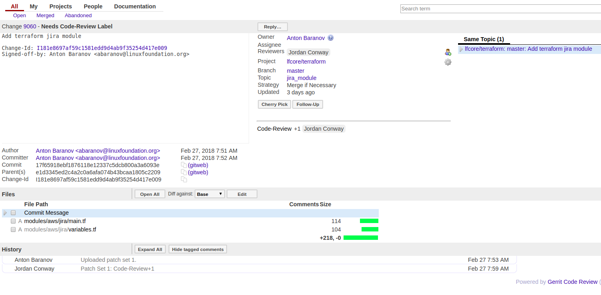
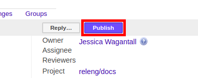
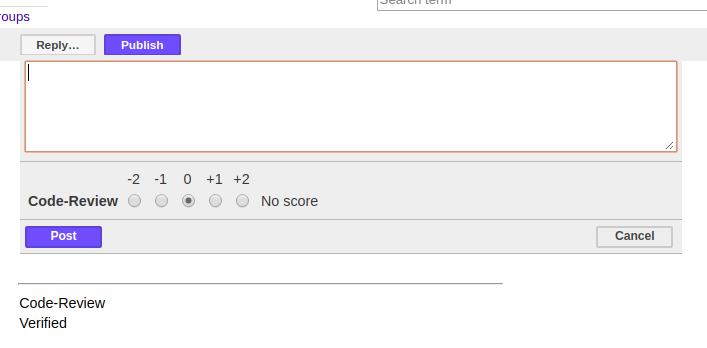
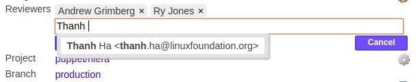
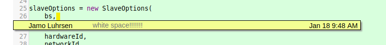
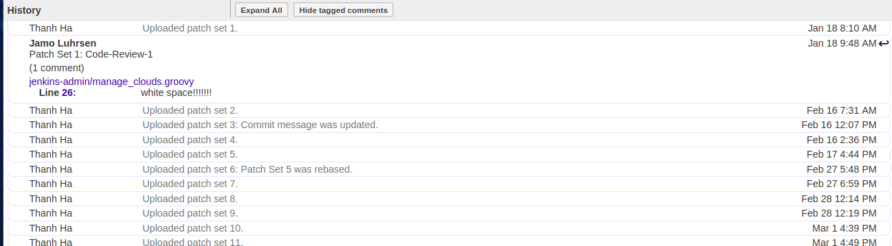
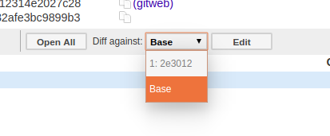
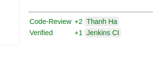

.. _lfreleng-docs-gerrit:

############
Gerrit Guide
############

Gerrit is an opensource web-based collaborative code review tool that
integrates with Git. Gerrit provides a framework for reviewing code commits
before it merges into the code base.
The changes are not made a part of the project until a code review completes.
Gerrit is also a good collaboration tool for storing the conversations that
occur around the code commits.

.. note::

   Here is more information on `Gerrit <https://www.gerritcodereview.com/>`_

Prerequisites
=============

Before you get started, you should have:

* an LFID account (sign up `here
  <https://identity.linuxfoundation.org/>`_)
* git installed (see: http://www.git-scm.com/downloads)
* git configured with your name, e-mail address and editor

  .. code-block:: bash

     git config --global user.name "Firstname Lastname"
     git config --global user.email "email@address.com"
     git config --global core.editor "text-editor-name"

  .. note:: Your name and e-mail address (including capitalization) must match what you entered
            when creating your LFID account.

* an ssh public/private key pair (see the good `GitHub docs on generating ssh keys
  <https://help.github.com/articles/generating-a-new-ssh-key-and-adding-it-to-the-ssh-agent/>`_)

* register in the Gerrit server. See below for detailed instructions.
  :ref:`register-key-gerrit`

* git-review installed (see: https://www.mediawiki.org/wiki/Gerrit/git-review#Installation)

Clone the code
==============

Cloning the code into a local workspace can happen via HTTP or SSH.

#. Make sure your Gerrit settings are up to date with correct SSH and GPG keys.

#. In the project's Gerrit instance, we can see the HTTP and SSH commands. From
   the left side menu, select Projects->List->Select any project->General.

#. Copy the desired clone command and paste it in your terminal.

SSH Clone
---------

This option provides a more secure connection. We should always use SSH for
pushing code unless the user is under a network that prevents SSH usage.
In such case, use HTTPS.

.. note::

   For more information on how to generate the public/private key pair see
   `Generating SSH keys for your system`_ and
   `Register your SSH key with Gerrit`_

.. note::

   The SSH clone option will not appear if the settings are not updated with
   the correct SSH keys.

#. Browse for the project's General information.

#. Click on the ssh tab.

#. Clone desired repo. For example:

   .. code-block:: bash

      git clone ssh://USERNAME@gerrit.linuxfoundation.org:29418/releng/docs

   .. note::

      Since we are constantly working on uploading new code into the
      repositories, we recommend to use SSH clones since the remotes for
      pushing code get configured appropriately.

Anonymous HTTP Clone
--------------------

Recommended if the intention is to view code and not make any contributions:

#. Browse the project and click ``General``

#. Click ``anonymous http`` tab.

#. Clone desired repo. For example:

   .. code-block:: bash

      git clone https://gerrit.linuxfoundation.org/releng/docs

Authenticated HTTP Clone
------------------------

This works everywhere, even behind a proxy or a firewall.

#. Get the password by clicking on the username on the top right->Settings->
   HTTP Password->Generate Password

#. Browse for the project and click ``General``.

#. Click  ``http`` tab.

#. Clone desired repo. For example:

   .. code-block:: bash

      git clone https://USERNAME@gerrit.linuxfoundation.org/infra/a/releng/docs

#. Follow the user/password prompts.

.. note::

   For Gerrit < 2.14 the HTTP password is not the same as the Linux Foundation ID password.

.. note::

   For Gerrit with HTTP configuration, the HTTP Password is in the User Name
   (Top right corner) -> Settings -> HTTP Password -> Generate Password.

Clone with commit-msg hook
--------------------------

Both SSH and HTTP clone options have a clone with commit-msg hook which adds
a hook to handle the Change-Id_ field in the footer of the
commit message.

#. Browse for the project and click ``General``.

#. Click ``Clone with commit-msg hook``. For example:

   .. literalinclude:: _static/commit-hook.example
       :language: bash

   OR

   .. literalinclude:: _static/commit-hook-curl.example
       :language: bash

   .. note::

      The hook implementation is intelligent at inserting the Change-Id_ line before
      any Signed-off-by or Acked-by lines placed at the end of the commit message by
      the author, but if no lines are present then it will insert a blank line, and
      add the Change-Id_ at the bottom of the message.

      If a Change-Id_ line is already present in the message footer, the script will do
      nothing, leaving the existing Change-Id_ unmodified. This permits amending an existing
      commit, or allows the user to insert the Change-Id_ manually after copying it from
      an existing change viewed on the web.

#. (Optional). To prevent the Change-Id_ addition, set gerrit.createChangeId to false in the
   git config.

Push patches to Gerrit
======================

#. Open a shell to the directory containing the project repo
#. Create a local working branch, based on the branch you would like to make
   changes to.

   .. code-block:: bash

      git fetch origin
      git checkout -b new_feature_branch origin/master

   Replace *origin/master* with whichever remote/branch you need to contribute
   to. Typically master is the latest development branch.

#. Make the modifications you would like to change in the project
#. Stage the modified files for commit. (Repeat for all files modified)

   .. code-block:: bash

      git add /path/to/file

#. Verify the staged files by running ``git status``
#. Commit the staged files by amending the patch

   .. code-block:: bash

      git commit -s

   .. note::

      The '-s' argument signs the commit message with your name and email and
      is a statement that you agree to the :ref:`dco`.

#. Push the patch to Gerrit using one of the 2 methods documented:

   #. :ref:`gerrit-push-git-review`
   #. :ref:`gerrit-push-git-push`

.. _gerrit-push-git-review:

Push using git review
---------------------

We recommend using `git-review <https://docs.openstack.org/infra/git-review/>`_
if possible as it makes working with Gerrit much easier.

#. Install ``git-review`` via your local package management system

   If your distro does not package git-review or you need a newer version.

   Install it via PyPi in a virtualenv_ environment:

   .. code-block:: bash

      virtualenv ~/.virtualenvs/git-review
      pip install git-review

#. Push the patch to Gerrit

   .. code-block:: bash

      git review

   We can optionally pass the parameter ``-t my_topic`` to set a
   :ref:`topic <gerrit-topics>` in
   Gerrit. Useful when we have related patches to organize in one
   :ref:`topic <gerrit-topics>`.

Once pushed we should see some output in the terminal as described in
:ref:`Gerrit Push Output <gerrit-push-output>`.

.. _gerrit-push-git-push:

Push using git push
-------------------

This method is a useful fallback in situations where we cannot use
:ref:`git-review <gerrit-push-git-review>`.

#. Use the following command:

   .. code-block:: bash

      git push <remote> HEAD:refs/for/master

   Where <remote> is the Gerrit location to push the patch to. Typically
   'origin' but can also be 'gerrit' depending on how we have our local repo
   setup.

.. note::

   Notice the word "for" is explicitly intending to perform the push into Gerrit.
   Using "heads" instead, will attempt to make the a push into the repository bypassing
   Gerrit which can come in handy for some isolated cases (when having force push rights).
   Another variable commonly used is "refs/changes/<gerrit-number>" which is an explicit
   way of making an update to an existing gerrit. In such case, is best to let gerrit handle
   this via Change-Id_ in the commit text.

   More options for this command: `git-push <https://git-scm.com/docs/git-push>`_.

Once pushed we should see some output in the terminal as described in
:ref:`Gerrit Push Output <gerrit-push-output>`.

.. _gerrit-push-output:

Push output
-----------

After pushing a commit to Gerrit we should see the following output:

.. literalinclude:: _static/push-success.example
   :language: bash

This output includes a URL to the patch. The number at the end is the patch's
change number.

Update an existing patch
========================

In a healthy Open Source project code reviews will happen and we will need to
amend the patches until reviewers are happy with the change. This section will
walk through the process of updating a patch that is already in
Gerrit Code Review.

#. Open a shell to the directory containing the project repo
#. Pull the latest version of the patch from Gerrit

   .. code-block:: bash

      git review -d ${change_number}

   The change number is in the URL of the Gerrit patch.
   For example if the URL is https://git.opendaylight.org/gerrit/75307
   then run ``git review -d 75307`` to pull the corresponding changes.

   (Optional) View information on the latest changes made to that patch.

   * To view the edited files, run ``git show``.
   * To view a listing of the edited files and the number of lines in those
     files, run ``git show --stat``.

#. Rebase the patch before you start working on it

   .. code-block:: bash

      git pull --rebase

   This is to ensure that the patch incorporates the latest version of the
   repo and is not out of date.

#. Make the necessary changes to the patch with your favorite editor
#. Check the state of the repo by running ``git status``
#. Stage the modified files for commit. (Repeat for all files modified)

   .. code-block:: bash

      git add /path/to/file

#. Verify the staged files by running ``git status``
#. Commit the staged files by amending the patch

   .. code-block:: bash

      git commit --amend

#. Update the current patch description and then save the commit request.

   If you feel as though you added enough work on the patch, add your name
   in the footer with a line ``Co-Authored-By: Firstname Lastname <email>``.

#. Rebase the patch one last time

   .. code-block:: bash

      git pull --rebase

   This is to ensure that the patch incorporates the latest version of the
   repo and is not out of date.

#. Submit your files for review:

   .. code-block:: bash

      git review

You will receive 2 emails from Gerrit Code Review: the first indicating that
a build to incorporate your changes has started; and the second indicating
the whether the build passed or failed. Refer to the console logs if the
build has failed and amend the patch as necessary.

Update a patch with dependent changes
=====================================

In the case where a patch depends on another in review Gerrit patch, we will
need to rebase the commit against the latest patchset of the dependent change
in Gerrit. The best way to do this is to retrieve the latest version of the
dependent change and then cherry-pick our patch on top of the change.

#. Fetch latest parent patch set

   .. code-block:: bash

      git review -d <parent-gerrit-id>

#. Cherry-pick out patch on top

   .. code-block:: bash

      git review -x <patch-gerrit-id>

#. Push patch back up to Gerrit

   .. code-block:: bash

      git review -R

Rebasing a change against master
================================

In the case that your patchset cannot be re-based via the U/I (merge conflict)

   .. code-block:: bash

      git pull origin master
      git review -d 12345
      git rebase master
      "fix conflicts"
      git add *
      git rebase --continue
      git review

Code Review
===========

All contributions to Git repositories use Gerrit for code review.

The code review process provides constructive feedback about a proposed change.
Committers and interested contributors will review the change, give their feedback,
propose revisions and work with the change author through iterations of the patch until
it’s ready for merging.

Managing and providing feedback for the change happens via Gerrit web UI.

   Gerrit wide view.

Pre-review
----------

Change authors will want to push changes to Gerrit before they are actually
ready for review. This is an encouraged good practice. It has been the
experience of experienced community members that pushing often tends to reduce
the amount of work and ensures speedy code reviews.

.. note::

    This is not required and in some projects, not encouraged, but the general idea
    of making sure patches are ready for review when submitted is a good one.

.. note::

    While in draft state, Gerrit triggers, e.g., verify Jenkins jobs, won’t run
    by default. You can trigger them despite it being a draft by adding
    "Jenkins CI" (or the corresponding Jenkins automation account) as a
    reviewer. You may need to do a recheck by replying with a comment
    containing ``recheck`` to trigger the jobs after adding the reviewer.

To mark an uploaded change as not ready for attention by committers and interested
contributors (in order of preference), either mark the Gerrit a draft (by adding
a ``-D`` to your ``git review`` command), vote -1 on it yourself or edit the commit
message with "WIP" ("Work in Progress").

Do not add committers to the Reviewers list for a change while in the pre-review
state, as it adds noise to their review queue.

Review
------

Once an author wants a change reviewed, they need to take some actions to put it on
the radar of the committers.

If the change it's a draft, you'll need to publish it. Do this from the Gerrit web UI.

   Gerrit Web UI button to publish a draft change.

Remove your -1 vote if you've marked it with one. If you think the patch is ready for
merge, vote +1. If there is not an automated job to test your change and vote +1/-1
for Verified, you will need to do as much testing yourself as possible and then manually
vote +1 to Verified. You can also vote +1 for Verified if you have done testing in
addition to any automated tests. Describing the testing you did or did not do is
typically helpful.

   Gerrit voting interface, exposed by the Reply button.

Once the change gets published and you have voted for merging, add the people who
need to review/merge the change to the Gerrit Reviewers list. The auto-complete for
this Gerrit UI field is somewhat flaky, but typing the full name from the start
typically works.

   Gerrit Reviewers list with Int/Pack committers added

Reviewers will give feedback via Gerrit comments or inline against the diff.

   Gerrit inline feedback about a typo

Updated versions of the proposed change get pushed as new patchsets to the same
Gerrit, either by the original submitter or other contributors. Amending proposed changes
owned by others while reviewing may be more efficient than documenting the problem, -1ing,
waiting for the original submitter to make the changes, re-reviewing and merging.

Download changes for local manipulation and re-uploaded updates via git-review.

See `Update an existing patch`_ above. Once you have re-uploaded the patch the Gerrit web
UI for the proposed change will reflect the new patchset.

   Gerrit history showing a patch update

Reviewers will use the diff between the last time they gave review and the current patchset
to understand updates, speeding the code review process.

   Gerrit diff menu

Iterative feedback continues until reaching consensus (typically: all active reviewers +1/+2
and no -1s nor -2s), at least one committer +2s and a committer merges the change.

   Gerrit code review votes

Merge
-----

Once a patch has gotten a +2 from a committer and they have clicked the submit button the
project's merge job should run and publish the project's artifacts to Nexus. Once completed,
other projects will be able to see the results of that patch.

This is important when merging dependent patches across projects. You will need to wait
for the merge job to run on one patch before any patches in other projects depending on
it will successful verify.

Set up Gerrit
=============

Generating SSH keys for your system
-----------------------------------

You must have SSH keys for your system to register with your Gerrit
account. The method for generating SSH keys is different for different
types of operating systems.

The key you register with Gerrit must be identical to the one you will
use later to pull or edit the code. For example, if you have a
development VM which has a different UID login and keygen than that of
your laptop, the SSH key you generate for the VM is different from the
laptop. If you register the SSH key generated on your VM with Gerrit and
do not reuse it on your laptop when using Git on the laptop, the pull
fails.

.. note::

    Here is more information on `SSH keys for Ubuntu
    <https://help.ubuntu.com/community/SSH/OpenSSH/Keys>`_
    and more on `generating SSH keys
    <https://help.github.com/articles/generating-ssh-keys/>`_

For a system running Ubuntu operating system, follow the steps below:

#. Run the following command::

      mkdir ~/.ssh
      chmod 700 ~/.ssh
      ssh-keygen -t rsa

#. Save the keys, and add a passphrase for the keys.

   This passphrase protects your private key stored in the hard drive.
   You must use the passphrase to use the keys every time you need
   to login to a key-based system::

      Generating public/private rsa key pair.
      Enter file in which to save the key (/home/b/.ssh/id_rsa):
      Enter passphrase (empty for no passphrase):
      Enter same passphrase again:

Your public key is now available as **.ssh/id\_rsa.pub** in your home
folder.

.. _register-key-gerrit:

Register your SSH key with Gerrit
---------------------------------

#. Using a Google Chrome or Mozilla Firefox browser, go to
   gerrit.<project>.org

#. Click **Sign In** to access the repositories.

   .. figure:: _static/gerrit-sign-in.png
      :alt: Sign into Gerrit

      Sign into Gerrit

#. Click your name in the top right corner of the window and then click
   **Settings**.

   The **Settings** page.

   .. figure:: _static/gerrit-settings.png
      :alt: Settings page for your Gerrit account

      Settings page for your Gerrit account

#. Click **SSH Public Keys** under **Settings**.

#. Click **Add Key**.

#. In the **Add SSH Public Key** text box, paste the contents of your
   **id\_rsa.pub** file and then click **Add**.

   .. figure:: _static/gerrit-ssh-keys.png
      :alt: Adding your SSH key

      Adding your SSH key

To verify your SSH key, try using an SSH client to connect to Gerrit’s
SSHD port::

    $ ssh -p 29418 <sshusername>@gerrit.<project>.org
    Enter passphrase for key '/home/cisco/.ssh/id_rsa':
    ****    Welcome to Gerrit Code Review    ****

Submit a patch over HTTPS
=========================

While we recommend you submit patchsets over SSH some users may need to
submit patchsets over HTTPS due to corporate network policies such as
the blocking of high range ports or outgoing SSH.

To submit code to Gerrit over HTTPS follow these steps.

.. note::

   This guide uses the Linux Foundation Gerrit server and the
   releng/docs project as an example. Differences may vary with other
   Gerrit servers.

Configure your Machine
----------------------

#. Generate a HTTPS password

   .. note::

      Required when uploading patches to Gerrit servers via HTTPS.

   Navigate to `<https://gerrit.linuxfoundation.org/infra/#/settings/http-password>`_
   and click **Generate Password**. Write this to the file **.netrc** in your
   home directory excluding the angle brackets::

     machine gerrit.linuxfoundation.org user <username> password <http-password>

#. Clone the repository over HTTPS using your Linux Foundation ID

   .. code-block:: shell

      git clone https://bramwelt@gerrit.linuxfoundation.org/infra/releng/docs

#. Download the commit-msg git hook

   .. code-block:: shell

      curl -Lo .git/hooks/commit-msg \
        https://gerrit.linuxfoundation.org/infra/tools/hooks/commit-msg && \
        chmod +x .git/hooks/commit-msg

   Due to a bug in git-review, you need to download the commit-msg hook
   manually to the .git/hooks/ directory or ``git-review -s`` will fail.

Configure the Repository
------------------------

Because ``git-review`` attempts to use SSH by default, you need
configure the git-review scheme and port through git-config in the
repository.

.. note::

   The Gerrit context path on the Linux Foundation Gerrit server is
   ``infra/``. Others Gerrit servers may use ``gerrit/`` or ``r/``.

#. Perform the following commands

   .. code-block:: shell

       cd docs/
       git config gitreview.scheme https
       git config gitreview.port 443
       git config gitreview.project infra/releng/docs

#. Verify the configuration by running the following command::

     git review -s

   If successful, the command will not print anything to the console, and
   you will be able to submit code with::

     git review

   Otherwise ``git-review`` will still request your Gerrit username,
   indicating a configuration issue.

   You can check the configuration using verbose output::

     git review -v -s

Sign Gerrit Commits
===================

1. Generate your GPG key.

   The following instructions work on a Mac, but the general approach
   should be the same on other OSes.

   .. literalinclude:: _static/gpg-setup.example

   If you are collaborating in keysigning, then send the output of
   ``gpg2 --fingerprint $KEY_ID`` to your coworkers.

   .. code-block:: bash

      gpg2 --fingerprint $KEY_ID
      # in the above example, the $KEY_ID would be F566C9B1
      # in my case, the output was:
      # pub   4096R/F566C9B1 2015-04-06 [expires: 2017-04-05]
      #       Key fingerprint = 7C37 02AC D651 1FA7 9209  48D3 5DD5 0C4B F566 C9B1
      # uid       [ultimate] Colin Dixon <colin at colindixon.com>
      # sub   4096R/DC1497E1 2015-04-06 [expires: 2017-04-05]

2. Install gpg, instead of or addition to gpg2.

   .. note:: you can tell Git to use gpg by doing:
     ``git config --global gpg.program gpg2``
     but that then will seem to struggle asking for your
     passphrase unless you have your gpg-agent set up right.

3. Add your GPG to Gerrit

   a. Run the following at the CLI:

      .. code-block:: bash

         gpg --export -a $FINGER_PRINT
         # e.g., gpg --export -a F566C9B1
         # in my case the output looked like:
         # -----BEGIN PGP PUBLIC KEY BLOCK-----
         # Version: GnuPG v2
         #
         # mQINBFUisGABEAC/DkcjNUhxQkRLdfbfdlq9NlfDusWri0cXLVz4YN1cTUTF5HiW
         # ...
         # gJT+FwDvCGgaE+JGlmXgjv0WSd4f9cNXkgYqfb6mpji0F3TF2HXXiVPqbwJ1V3I2
         # NA+l+/koCW0aMReK
         # =A/ql
         # -----END PGP PUBLIC KEY BLOCK-----

   b. Browse to https://git.opendaylight.org/gerrit/#/settings/gpg-keys
   c. Click Add Key...
   d. Copy the output from the above command, paste it into the box,
      and click Add

4. Set up your Git to sign commits and push signatures

   .. code-block:: bash

      git config commit.gpgsign true
      git config push.gpgsign true
      git config user.signingkey $FINGER_PRINT
      # e.g., git config user.signingkey F566C9B1

   .. note::

      We can create a signed commit with ``git commit -S`` and
      a signed push with ``git push --signed`` on the CLI instead of
      configuring it in config if we want to manually control which commits
      use the signature.

5. Create a signed commit

   a. Change a file
   b. Create a signed commit with ``git commit -asm "test commit"``

      This will result in Git asking you for your passphrase.
      Enter it to proceed.

6. Push to Gerrit with a signed-push with ``git review``

   This will result in Git asking you for your passphrase.
   Enter it to proceed.

   .. note::

      The signing a commit or pushing again with a signed push is not
      recognized as a "change" by Gerrit, so if you forget to do either, you
      need to change something about the commit to get Gerrit to accept the
      patch again. Slightly tweaking the commit message is a good way.

   .. note::

      This assumes you have git review set up and push.gpgsign
      set to true. Otherwise:

      ``git push --signed gerrit HEAD:refs/for/master``

      This assumes the gerrit remote is available, if not, configure
      something like: ``ssh://ckd@git.opendaylight.org:29418/<repo>.git``
      where repo is something like docs or controller

6. Verify the signature

   To do this, navigate to Gerrit and check for a green check next to your name in the patch.

   .. figure:: _static/gerrit-signed-push.png

      Example signed push to Gerrit.

Appendix
========

Developer's Certificate of Origin (DCO)
---------------------------------------

Code contributions to Linux Foundation projects must have a sign-off by the
author of the code which indicates that they have read and agree to the DCO.

.. literalinclude:: _static/dco-1.1.txt
   :language: none
   :caption: Developer's Certificate of Origin
   :name: dco

Refer to https://developercertificate.org/ for original text.

.. _gerrit-topics:

Gerrit Topics
-------------

Topics are useful as a search criteria in Gerrit. By entering ``topic:foo``
as a search criteria we can track related commits. Use one of the following
methods to configure topics:

1. Directly in the Gerrit UI via the Edit Topic button
2. Via ``git review`` using the ``-t topic`` parameter

   .. note::

      git-review defaults to the local branch name as the topic if it does not
      match the upstream branch.

3. Via ``git push`` using one of the following methods:

   .. code-block:: bash

      git push origin HEAD:refs/for/master%topic=some-topic
      git push origin HEAD:refs/for/master -o topic=some-topic

   Both methods achieve the same result so is up to preference. Further
   documentation available at `Gerrit Topics
   <https://gerrit-review.googlesource.com/Documentation/intro-user.html#topics>`_.

.. _Change-Id: https://gerrit.linuxfoundation.org/infra/Documentation/user-changeid.html
.. _virtualenv: https://virtualenv.pypa.io/en/stable/
