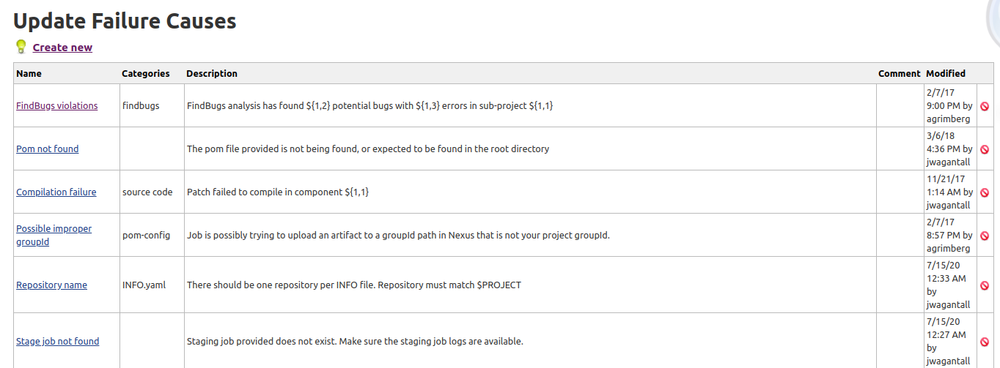
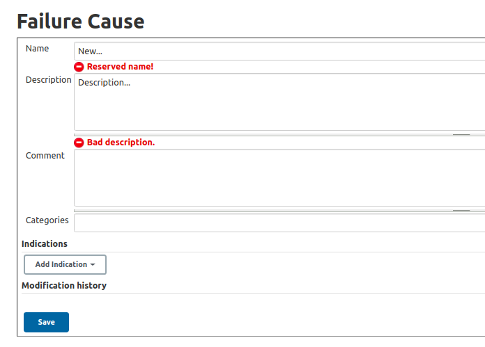

.. _jenkins-build-failure-analyzer:

##############################
Jenkins Build Failure Analyzer
##############################

The Build Failure Analyzer Jenkins plugin analyzes the causes of failed builds and
presents the causes on the build page.

It does this by using a knowledge base of build failure causes maintained from scratch.

Plugin Documentation
====================

Official plugin documentation:
https://plugins.jenkins.io/build-failure-analyzer/

``Make sure your Jenkins server has this plugin installed before proceeding.``

Plugin Permissions
==================

To configure the Build Failure Analyzer plugin's permissions select:
``Manage Jenkins`` -> ``Configure Global Security`` -> ``Authorization`` section

The table under the Authorization section will show the ``Build Failure Analyzer``
column.

Users and/or groups can add or remove the following permissions:

* View Causes
* Update Causes
* Remove Causes

View Causes
===========

Depending on the permissions granted to the groups to use the Build Failure Analyzer,
users will be able to see the ``Failure Cause Management`` option in the left side menu
in Jenkins.

This option will display the current causes in a table with:

* Name
* Categories
* Description
* Comment
* Modified
* Remove Cause Icon (Depending on permissions)

Update Causes
=============

The ``Create New`` option adds a new cause.

A new cause will require the following information:

* Name
* Description
* Comment
* Categories (It will autocomplete for any exisiting categories)
* Indications (What to look for in the log). Regex pattern or text)
* Modification history (Date, time and username)

To update an existing cause, click on a cause's name from the current table.

Delete Causes
=============

The last column of the causes table will show a remove icon for those groups with permissions
to Remove Causes. No icon will appear if this permission is not granted.

The same Remove option will appear if the user clicks on the name of any of the causes in the
table.
