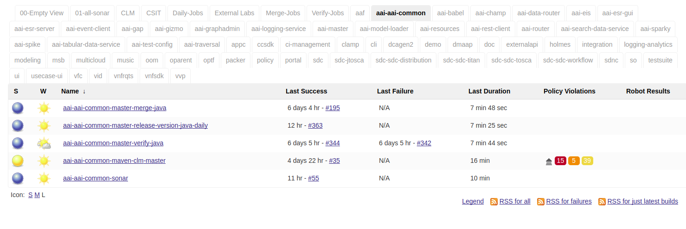

.. _jenkins-guide:

#############
Jenkins Guide
#############

The ``ci-management`` or ``releng/builder`` repos in an LF project consolidates the
Jenkins jobs from project-specific VMs to a single Jenkins server. Each Git repo in
every project has a view for their jobs on the main Jenkins server. The system utilizes
`Jenkins Job Builder <jjb-docs_>`_ for the creation and management of the
Jenkins jobs.

   Jenkins job project views.

Quick Start
===========

This section provides details on how to create jobs for new projects with minimal
steps. All users in need to create or contribute to new job types should read and
understand this guide.

As a new project you will be mainly interested in getting your jobs to appear
in the Jenkins server silo archiving it by creating a <project>.yaml in the
releng/builder or ci-management project's jjb directory.

Example for releng/builder projects:

.. code-block:: bash

    git clone --recursive https://git.opendaylight.org/gerrit/releng/builder
    cd builder
    mkdir jjb/<new-project>

Example for ci-management projects:

.. code-block:: bash

    git clone --recursive https://gerrit.onap.org/gerrit/ci-management
    cd ci-management
    mkdir jjb/<new-project>

Where <new-project> should be the same name as your project's Git repo in
Gerrit. If your project name is "aaa" then create a new jjb/aaa directory.

.. note::

    In similar matter, if your project name is "aaa/bbb" then create a new
    jjb/aaa-bbb directory by replacing all "/" with "-".

.. note::

    builder/jjb/global-jjb or ci-management/jjb/global-jjb are submodules of releng/builder or
    ci-management repositories which require a ``git submodule update --init`` or using
    --recursive with git clone to get them fetched.

Next we will create <new-project>.yaml as follows:

.. literalinclude:: _static/new-project-yaml.example
    :language: bash

Replace all instances of <new-project> with the name of your project as explained before.

The template above shows how to add each job from global-jjb. We recommend defining a local
job-group for the project or defining each job needed in a list.

Add the following jobs for minimal setup on a Maven based project:

.. code-block:: yaml

    - gerrit-maven-clm
    - gerrit-maven-merge
    - gerrit-maven-release
    - gerrit-maven-verify
    - gerrit-maven-sonar

Optionally, you can add other jobs as well:

.. code-block:: yaml

    - gerrit-maven-verify-dependencies

Global-jjb defines groups of jobs recommended for ci, maven, python, node, rtd and more future
languajes as global-jjb is always under constant improvement. If you would like to explore more about
these options available please refer to the `Global JJB Templates`_ section.

The changes to these files get published in Gerrit and reviewed by the releng/builder or
ci-management teams for the LF project. After approvals, these Gerrits get merged and
the jobs published in Jenkins.

.. code-block:: bash

    git add jjb/<new-project>
    git commit -sm "Add <new-project> jobs to Jenkins"
    git review

This will push the jobs to Gerrit and your jobs will appear in Jenkins once the
releng/builder or ci-management teams has reviewed and merged your patch.

Jenkins Production & Jenkins Sandbox
====================================

The Jenkins server is the home for all project's Jenkins jobs. All
maintenance and configuration of these jobs happen in JJB through the
ci-management or releng/builder repos. Project contributors can no longer edit the Jenkins jobs
directly on the server. Instead, we encourage them to use the Jenkins Sandbox.

.. todo:: RELENG-547

Build Minions
=============

.. todo:: RELENG-548

Log Server
==========

While Jenkins stores the console logs on the Jenkins instance, this is
short term and typically depending on the job type purged after a week. We
highly recommend preferring the log server over the Jenkins
system when viewing console logs as it reduces load on Jenkins and we compress
logs stored on the log server so downloads are faster.

We store Log server archives for ``6 months``.

At the end of a build the job ships logs to a Nexus logs repo and can be
conveniently accessed via the https://logs.example.org URL. The Job
Build Description will contain the specific log server URL for a build log.
Jobs triggered via Gerrit Trigger will have the URL to the logs left as a post
build comment.

Example Jenkins Build Description::

    Build logs: https://logs.opendaylight.org/releng/vex-yul-odl-jenkins-1/distribution-check-carbon/167

Example Gerrit Comment::

    jenkins-releng                                                  03-05 16:24
    Patch Set 6: Verified+1
    Build Successful
    https://jenkins.opendaylight.org/releng/job/builder-tox-verify-master/1066/ : SUCCESS
    Logs: https://logs.opendaylight.org/releng/vex-yul-odl-jenkins-1/builder-tox-verify-master/1066

The log path pattern for the logs server is
``LOG_SERVER_URL/SILO/JENKINS_HOSTNAME/JOB_NAME/BUILD_NUMBER`` typically if you
know the JOB_NAME and BUILD_NUMBER you can replace the paths before it to
convert the URL between Jenkins and the Log server.

Log Cleanup Schedule
====================

.. todo:: RELENG-550

Jenkins Job Builder
===================

.. todo:: RELENG-551

.. _lfdocs-global-jjb-templates:

Global JJB Templates
====================

Global-JJB is a library project containing reusable Jenkins Job Builder
templates. The intention is to save time for projects from having to define
their own job templates. Documentation is available via
:doc:`global-jjb documentation <global-jjb:index>` specific sections of
interest linked here:

* :doc:`CI Job Templates <global-jjb:jjb/lf-ci-jobs>`
* :doc:`Maven Job Templates <global-jjb:jjb/lf-maven-jobs>`
* :doc:`NodeJS Job Templates <global-jjb:jjb/lf-node-jobs>`
* :doc:`Python Job Templates <global-jjb:jjb/lf-python-jobs>`
* :doc:`ReadTheDocs Job Templates <global-jjb:jjb/lf-rtd-jobs>`

.. note::

   For infra admins, the CI Job Templates contain useful jobs for managing
   Jenkins and VM Images. We recommend to deploy these jobs to all new infra
   projects.

.. _lfdocs-packer-images:

Packer Images
=============

.. todo:: When dedicated packer docs exist reconsider where this doc should go.

The ci-management repo contains a directory called ``packer`` which contains
scripts for building images used by Jenkins to spawn builders. There are 2
files  necessary for constructing a new image:

1. packer/templates/BUILDER.json
2. packer/provision/BUILDER.yaml

Replace BUILDER with the name of your desired builder image type.

The templates file contains packer configuration information for building the
image. The provision file is a script for running commands inside the
packer-builder to construct the image. We recommend using the Ansible
provisioner as that is the standard used by LF packer builds.

While developing a new builder image type, we can use the
`lfdocs-jenkins-sandbox` to build and deploy the image for testing. Configure a
Jenkins Job the new image type using the global-jjb
:ref:`gerrit-packer-merge <gjjb-packer-merge>` job template.

Example job definition:

.. code-block:: yaml

   - project:
     name: packer-robot-jobs
     jobs:
       - gerrit-packer-merge

     project: releng/builder
     project-name: builder
     branch: master
     archive-artifacts: '**/*.log'

     build-node: centos7-builder-2c-1g

     platforms: centos-7
     templates: robot

The gerrit-packer-merge job creates jobs in the format
``PROJECT_NAME-packer-merge-PLATFORM-TEMPLATE``. Where PROJECT_NAME is the
``project-name`` field, PLATFORM is the ``platforms`` field, and TEMPLATES is
the ``templates`` field in the yaml above. In this example the resultant job is
``builder-packer-merge-centos-7-robot``.

Follow the instructions in the
:ref:`Pushing a patch to Gerrit <jenkins-sandbox-push-jobs>` section to push
this job to the Sandbox.

Once the job is on the Jenkins Sandbox, run the job and it will attempt to
deploy the new image and make it available. Once the job completes look for a
line in the logs that look like::

    ==> vexxhost: Creating the image: ZZCI - CentOS 7 - robot - 20180301-1004

This line provides the name of the new image we built.

.. _lfdocs-jenkins-sandbox:

Jenkins Sandbox
===============

Sandbox Overview
----------------

The Jenkins Sandbox has similar configuration to the production instance.
It cannot publish artifacts or vote in Gerrit which makes it a safe environment
to test the jobs. The Sandbox has limited amount of Virtual Machine nodes instances
to test compared to production Jenkns.

Facts to keep in mind before working on the Sandbox:

- Jobs are automatically deleted every Saturday at 08:00 UTC
- Committers can login and configure Jenkins jobs in the Sandbox directly
- Sandbox jobs cannot perform any upload/deploy tasks
- There are no project configuration files and project credentials loaded into the system
- Sandbox jobs cannot vote on Gerrit
- Jenkins nodes have OpenStack configuration similarly to the production instance

Get access to the Sandbox
-------------------------

The Sandbox provides a testing/experimentation environment used before
pushing job templates to the production instance.

To access the Sandbox use: jenkins.<project-domain>/sandbox

The access to the Sandbox uses the same LFID used in the production Jenkins
instance, but in this case a new `LF Helpdesk <mailto:helpdesk@rt.linuxfoundation.org>`_ ticket
(for the related project) needs creation to request the sanbox access.

.. todo:: Link to Opening Helpdesk ticket docs

The LF helpdesk team can add users to the appropriate group to grant permissions
to access the Sandbox via https://identity.linuxfoundation.org/.
The group that controls this access is <project>-jenkins-sandbox-access
For example:
``https://identity.linuxfoundation.org/content/<project>-jenkins-sandbox-access``

The requester will receive an invitation to join this group.
Once accepted, the user can now access the Sandbox same way as the production
Jenkins.

.. _jenkins-sandbox-push-jobs:

Push jobs to Jenkins Sandbox
----------------------------

Push jobs to the Jenkins Sandbox using one of these methods:

1. :ref:`Via Gerrit Comment <jjb-push-gerrit-comment>`
2. :ref:`Via JJB CLI <jjb-push-cli>`

**Method 1** is easier as it does not require installing anything on your local
system. This method requires pushing the patch to Gerrit on each test. We
recommend this method for quick one off edits or if you are testing another
contributor's patch.

**Method 2** is more convenient for those who work on JJB templates more than
once or twice.

.. _jjb-push-gerrit-comment:

Push jobs via Gerrit comment
----------------------------

This is the easiest and fastest way to start using the Sandbox. This is the recommended
default way to use the Sandbox since this does not require the user to install JJB or
configure it at all.

This is the recommended way to push jobs to the Sandbox system and does not require
installation of Jenkins Job Builder locally.

To push jobs to the Sandbox with jjb-deploy, add a comment on the Gerrit patch from ci-management:

.. code-block:: bash

   jjb-deploy <job name>

The resultant job's configuration reflects the same code the patch's code base in the Gerrit.
The job pushed into the Sandbox will reflect the changes made in the patch.

.. note::

   You can use * wildcard for job names. This is not a good practice.
   We highly recommended to use specific Jenkins job names instead.

.. _jjb-push-cli:

Push jobs via JJB CLI
---------------------

JJB CLI needs configuration first.

.. note::

   Use this configuration if you prefer to use the JJB tool locally on your system.

After getting access to the Sanbox group, configure the following.

Create a jenkins.ini with the following contents modifying the relevant data:

Example::

   ;<jenkins.ini contents>

   [job_builder]
   ignore_cache=True
   keep_descriptions=False
   recursive=True

   [jenkins]
   user-id=<Provide your Jenkins Sandbox user-id (LFID)>
   password= <Refer below steps to get API token>
   url=https://jenkins.<project-domain>/sandbox
   ignore_cache=True

How to retrieve API token?
Login to the Jenkins Sandbox using your LFID, go to the user page by clicking on
your username. Click Configure and then click Show API Token.

To start using the Sandbox, we must do a clone of ci-management or releng/builder
(in case of ODL) repo for the project.
For example:

.. code-block:: bash

   git clone ssh://<LFID>@gerrit.<project-domain>:29418/ci-management

Make sure you sync global-jjb also using:

.. code-block:: bash

   git submodule update --init

Install JJB (Jenkins Job Builder).

Execute the following commands to install JJB on your machine:

.. code-block:: bash

   cd ci-management (or cd builder)
   sudo pip install virtualenvwrapper
   mkvirtualenv jjb
   pip install jenkins-job-builder
   jenkins-jobs --version
   jenkins-jobs test --recursive jjb/

.. note::

   More information on `Python Virtual Environments <https://virtualenv.readthedocs.io/en/latest/>`_

To work on existing jobs or create new jobs, navigate to the `/jjb` directory
where you will find all job templates for the project.  Follow the below commands
to test, push or delete jobs in your Sandbox environment.

.. _verify-jjb:

Verify JJB
^^^^^^^^^^

After you edit or create new job templates, test the job in the Sandbox
environment before you submit this job to production CI environment.

.. code-block:: bash

   jenkins-jobs --conf jenkins.ini test jjb/ <job-name>

For Example:

.. code-block:: bash

   jenkins-jobs --conf jenkins.ini test jjb/ ci-management-jjb-merge

If the job you would like to test is a template with variables in its name, it
must be manually expanded before use. For example, the commonly used template
`{project-name}-jjb-merge` might expand to `ci-management-jjb-merge`.

A successful test will output the XML description of the Jenkins job described
by the specified JJB job name.

Execute the following command to pipe-out to a directory:

.. code-block:: bash

   jenkins-jobs --conf jenkins.ini test jjb/ <job-name> -o target

The output directory will contain files with the XML configurations.

.. _push-job:

Push a Job
^^^^^^^^^^

Ensure you have configured your jenkins.ini and verified it by outputting valid
XML descriptions of Jenkins jobs. Upon successful verification, execute the
following command to push the job to the Sandbox:

.. code-block:: bash

   jenkins-jobs --conf jenkins.ini update jjb/ <job-name>

For Example:

.. code-block:: bash

   jenkins-jobs --conf jenkins.ini update jjb/ ci-management-jjb-merge

Delete a Job
^^^^^^^^^^^^

Execute the following command to Delete a job from Sandbox:

.. code-block:: bash

   jenkins-jobs --conf jenkins.ini delete jjb/ <job-name>

For Example:

.. code-block:: bash

   jenkins-jobs --conf jenkins.ini delete jjb/ ci-management-jjb-merge

You can also delete the job from the UI options in Jenkins Sandbox.

Edit Job via Web UI
-------------------

In the Sandbox, you can directly edit the job configuration by selecting
the job name and clicking on the Configure button.
Click the Apply or Save (to save and exit the configuration) buttons to save the job.

This is useful in the case where you might want to test quick tweaks to a job before
modifying the YAML.

Edit the job in your terminal and follow the described steps in
:ref:`Verify JJB <verify-jjb>` and `Push Job <push-job>`
to push any changes and have them ready to push to Gerrit.

.. important::

   When pushing to the Sandbox with `jenkins-jobs`, do not forget the <job-name>
   parameter. Otherwise, JJB will push all job templates into the Sandbox and
   will flood the system.

   If that happens, use **`ctrl+c` to cancel the upload**.

A successful run of the desired job will look like this:

.. code-block:: bash

   INFO:jenkins_jobs.builder:Number of jobs generated:  1

Execute jobs in the Sandbox
---------------------------

Once you push the Jenkins job configuration to the Sandbox environment, run the
job from the Sandbox WebUI. Follow the below process to trigger the build:

1. Login into the Jenkins Sandbox WebUI
2. Click on the job which you want to trigger
3. Click "Build with parameters"
4. Click Build
5. Verify the Build Executor Status bar to check on progress.

You can click on the build number to view the job details and console output.

.. _jjb-docs: http://ci.openstack.org/jenkins-job-builder/

