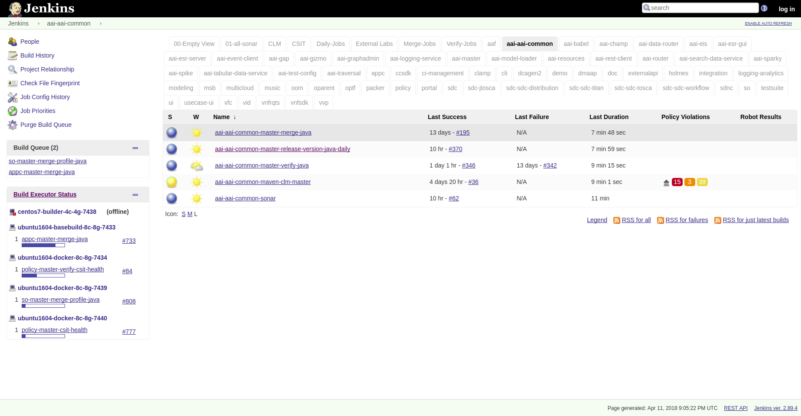

.. _jenkins-guide:

#############
Jenkins Guide
#############

The ``ci-management`` or ``releng/builder`` repos in an LF project consolidates the
Jenkins jobs from project-specific VMs to a single Jenkins server. Each Git repo in
every project has a view for their jobs on the main Jenkins server. The system utilizes
`Jenkins Job Builder <jjb-docs_>`_ for the creation and management of the
Jenkins jobs.

.. toctree::
    :hidden:

    jenkins-sandbox

.. _jenkins-quick-start:

Quick Start
===========

This section provides details on how to create jobs for new projects with minimal
steps. All users in need to create or contribute to new job types should read and
understand this guide.

As a new project you will be mainly interested in getting your jobs to appear
in the Jenkins server silo archiving it by creating a <project>.yaml in the
releng/builder or ci-management project's jjb directory.

Example for releng/builder projects:

.. code-block:: bash

    git clone --recursive https://git.opendaylight.org/gerrit/releng/builder
    cd builder
    mkdir jjb/<new-project>

Example for ci-management projects:

.. code-block:: bash

    git clone --recursive https://gerrit.onap.org/gerrit/ci-management
    cd ci-management
    mkdir jjb/<new-project>

Where <new-project> should be the same name as your project's Git repo in
Gerrit. If your project name is "aaa" then create a new jjb/aaa directory.

.. note::

    In similar matter, if your project name is "aaa/bbb" then create a new
    jjb/aaa-bbb directory by replacing all "/" with "-".

.. note::

    builder/jjb/global-jjb or ci-management/jjb/global-jjb are submodules of releng/builder or
    ci-management repositories which require a ``git submodule update --init`` or using
    --recursive with git clone to get them fetched.

Next we will create <new-project>.yaml as follows:

.. literalinclude:: _static/new-project-yaml.example
    :language: bash

Replace all instances of <new-project> with the name of your project as explained before.

The template above shows how to add each job from global-jjb. We recommend defining a local
job-group for the project or defining each job needed in a list.

Add the following jobs for minimal setup on a Maven based project:

.. code-block:: yaml

    - gerrit-maven-clm
    - gerrit-maven-merge
    - gerrit-maven-release
    - gerrit-maven-verify
    - gerrit-maven-sonar

Optionally, you can add other jobs as well:

.. code-block:: yaml

    - gerrit-maven-verify-dependencies

Global-jjb defines groups of jobs recommended for ci, maven, python, node, rtd and more future
languages as global-jjb is always under constant improvement. If you would like to explore more about
these options available please refer to the `Global JJB Templates`_ section.

The changes to these files get published in Gerrit and reviewed by the releng/builder or
ci-management teams for the LF project. After approvals, these Gerrits get merged and
the jobs published in Jenkins.

.. code-block:: bash

    git add jjb/<new-project>
    git commit -sm "Add <new-project> jobs to Jenkins"
    git review

This will push the jobs to Gerrit and your jobs will appear in Jenkins once the
releng/builder or ci-management teams has reviewed and merged your patch.

.. _jenkins-build-agents:

Build agents
============

Jenkins jobs run on build agents (executors) created on demand and deleted when the job
terminates. Jenkins supports different types of dynamic build nodes and developers must
know the flavors available to run their custom jobs.

Jenkins uses the OpenStack Cloud plugin to administer node templates and configuration
for the node instances. For more information on the template:
``https://wiki.jenkins.io/display/JENKINS/Openstack+Cloud+Plugin``

Projects requiring a specific build configuration can submit a change to the ``ci-management``
or ``releng`` repos.

Refer to the :ref:`Jenkins Configuration Merge <lf-global-jjb-jenkins-cfg-merge>`
section to understand how the configuration changes get merged.

.. note::

   Here is an example from OpenDaylight:
   https://github.com/opendaylight/releng-builder/tree/master/jenkins-config/clouds/openstack/odlvex

For details on how to build an image for a particular build flavor, refer to the
:ref: `Packer Images <lfdocs-packer-images>` section.

.. _jenkins-cloud-cfg:

Cloud configuration (Global Configuration)
------------------------------------------

This information will help developers (who do not have administer permissions) understand how
LFIT configures a cloud and build agents via OpenStack Cloud plugin:

#. Log in into Jenkins and click on ``Manage Jenkins``

   .. image:: _static/minions-manage-jenkins.png

#. Scroll to the ``Cloud`` section

#. Click ``Add a new cloud``, ``Cloud (OpenStack)``

   .. image:: _static/minions-add-cloud.png

#. Fill the require information for Cloud provider, URL, credentials and region

   .. note::

      Click ``Test Connection`` to make sure the parameters provided establishes a connection.

   .. image:: _static/minions-test.png

#. Configure ``Default slave options...``

   .. note::

      The ``Default slave options`` can be overwritten for a particular node flavor
      using the ``Template Advanced`` options

   .. image:: _static/minions-defaults.png

#. Click ``Add template`` and provide a node ``Name`` and ``Labels``

   .. image:: _static/minions-template.png

#. Specify a ``build-node`` in a project's yaml file:

   .. code-block:: bash

      build-node: ubuntu1604-builder-4c-4g

   .. note::

      The value should match an available ``Label`` for the node template.

.. _jenkins-build-agents-flavors:

Build agents flavors
--------------------

This section points to each LF project's build agents availability and flavors.

* Acumos: https://github.com/acumos/ci-management/tree/master/jenkins-config/clouds/openstack/ACUMOSVEX
* Akraino: https://github.com/akraino-edge-stack/ci-management/tree/master/jenkins-config/clouds/openstack/cattle
* EdgeX Foundry: https://github.com/edgexfoundry/ci-management/tree/master/jenkins-config/clouds/openstack/Primary
* FD.io: https://github.com/FDio/ci-management/tree/master/jenkins-config/clouds
* ONAP: https://github.com/onap/ci-management/tree/master/jenkins-config/clouds/openstack/cattle
* OpenDaylight (ODL): https://github.com/opendaylight/releng-builder/tree/master/jenkins-config/clouds/openstack/odlvex
* O-RAN: https://github.com/o-ran-sc/ci-management/tree/master/jenkins-config/clouds/openstack/cattle
* Zowe: https://github.com/zowe/ci-management/tree/master/jenkins-config/clouds/openstack/cattle

.. _jenkins-log-server:

Managed Config Files
====================

Jobs in Jenkins make extensive use of Managed Config Files for different types
of files that store configuration or credentials. These files live in the
ci-management repository along side of the rest of the community configurable
components under the ``jenkins-config/managed-config-files`` directory tree.

This directory tree has the following case sensitive format:
::

   ci-mangement
   |- jenkins-admin
      |- managed-config-files
         |- <config_type>
            |- <file_id>
               |- config-params.yaml
               |- content
               |- ??CredentialMappings.yaml
               |- ??CrednetialMappings.sandbox.yaml
         ...

Configuration of credentials for production Jenkins systems come from the
??CredentialMappings.yaml file.

Configuration of credentials for sandbox Jenkins systems come from the
??CredentialMappings.sandbox.yaml file.

The config_type will correspond to the type that is under management as per how
JCasC itself defines the file type.

Common types in the LF environment are:

* custom
* globalMavenSettings
* json
* mavenSettings
* openstackUserData
* properties

The file_id is precisely what the ID of the file should be for reference. The
LF Release Engineering pratice is to always set a human readable / relatable
ID.

config-params.yaml are all the parameters related to this particular file that
are _not_ the content of it or the credential mappings or the file content.

The content file is the actual file that is under management. This must be a
non-escaped version of the content for the field. It will be appropriately
escaped when converted into the corresponding JCasC yaml.

The two double ? in the name of the CredentialMappings files must have the
appropriate mapping definition.

The mapping type will use a verbatim copy when converting to the JCasC so it
should be properly configured to match the config_type.

The known breakdown of config_type to CredentialMappings is:

* custom -> customizedCredentialMappings
* mavenSetings -> serverCredentialMappings
* properties -> propertiesCredentialMappings

The following is the layout for a custom file with the ID of example

.. literalinclude:: _static/managed_config-examples/custom-config-params.yaml
   :language: yaml
   :caption: custom/example/config-params.yaml

.. literalinclude:: _static/managed_config-examples/custom-content
   :language: bash
   :caption: custom/example/content

.. literalinclude:: _static/managed_config-examples/custom-customizedCredentialMappings.yaml
   :language: bash
   :caption: custom/example/customizedCredentialMappings.yaml

.. literalinclude:: _static/managed_config-examples/custom-customizedCredentialMappings.sandbox.yaml
   :language: bash
   :caption: custom/example/customizedCredentialMappings.sandbox.yaml

Log Server
==========

While Jenkins stores the console logs on the Jenkins instance, this is
short term and typically depending on the job type purged after a week. We
highly recommend preferring the log server over the Jenkins
system when viewing console logs as it reduces load on Jenkins and we compress
logs stored on the log server so downloads are faster.

We store Log server archives for ``6 months``.

At the end of a build the job ships logs to a Nexus logs repo and can be
conveniently accessed via the https://logs.example.org URL. The Job
Build Description will contain the specific log server URL for a build log.
Jobs triggered via Gerrit Trigger will have the URL to the logs left as a post
build comment.

Example Jenkins Build Description::

    Build logs: https://logs.opendaylight.org/releng/vex-yul-odl-jenkins-1/distribution-check-carbon/167

Example Gerrit Comment::

    jenkins-releng                                                  03-05 16:24
    Patch Set 6: Verified+1
    Build Successful
    https://jenkins.opendaylight.org/releng/job/builder-tox-verify-master/1066/ : SUCCESS
    Logs: https://logs.opendaylight.org/releng/vex-yul-odl-jenkins-1/builder-tox-verify-master/1066

The log path pattern for the logs server is
``LOG_SERVER_URL/SILO/JENKINS_HOSTNAME/JOB_NAME/BUILD_NUMBER`` typically if you
know the JOB_NAME and BUILD_NUMBER you can replace the paths before it to
convert the URL between Jenkins and the Log server.

We compress and store individual log files in gzip (.gz) format on the
Nexus log repository. You can access these files through the URL.

* Jenkins Production:
  ``https://logs.example.org/production``
* Jenkins Sandbox:
  ``https://logs.example.org/sandbox``

.. _jenkins-log-cleanup-schedule:

Log Cleanup Schedule
====================

The log servers are setup with cron jobs that purge logs during regular
scheduled intervals.

* Jenkins Production: Delete logs everyday at 08:00 UTC which are older
  than 180 days.
* Jenkins Sandbox: Delete logs and jobs every week on Saturday at 08:00 UTC.

.. _jenkins-jjb:

Jenkins Job Builder
===================

Jenkins Job Builder takes simple descriptions of Jenkins jobs in YAML format
and uses them to configure Jenkins.

* `Jenkins Job Builder (JJB) documentation <http://ci.openstack.org/jenkins-job-builder>`_

.. _jenkins-jjb-overview:

JJB Overview
------------

Jenkins Job Builder translates YAML code to job configuration suitable
for consumption by Jenkins. When testing new Jenkins Jobs in the
:doc:`Jeknins Sandbox <jenkins-sandbox>`, you will need to use the
``jenkins-jobs`` executable to translate a set of jobs into their XML
descriptions and upload them to the Jenkins Sandbox server.

.. _jenkins-jjb-install:

Install JJB
-----------

You can install the latest version of JJB and its dependencies with
`pip <Install JJB using pip_>`_ using Python `Virtual Environments`_ or lock a
specific version of JJB in `jjb/requirements.txt`, as a workaround for known
issues. The documentation is available in `pip-assisted <Install JJB using pip_>`_ install.

.. _jenkins-virtualenv:

Virtual Environments
--------------------

For `pip-assisted <Install JJB using pip_>`_, we recommend using
`Python Virtual Environments <https://virtualenv.readthedocs.org/en/latest/>`__
to manage JJB and it's Python dependencies.

The documentation to `install virtual environments <https://virtualenvwrapper.readthedocs.org/en/latest/>`_
with ``virtualenvwrapper``. On Linux systems with pip run:

.. code-block:: bash

    pip install --user virtualenvwrapper

A virtual environment is a directory that you install Python programs
into and update the shell's $PATH, which allows the version installed in the
virtual environment to take precedence over any system-wide versions available.

Create a new virtual environment for JJB.

.. code-block:: bash

    virtualenv jjb

With in your virtual environment active, you can install JJB which is
visible when the virtual environment that is active.

To activate your virtual environment.

.. code-block:: bash

    source ./jjb/bin/activate
    # or
    workon jjb

To deactivate your virtual environment.

.. code-block:: bash

    deactivate

.. _jenkins-jjb-install-pip:

Install JJB using pip
---------------------

To install JJB and its dependencies, make sure you have created and activated
a `virtual environment <Virtual Environments_>`_ for JJB.

#. Set a virtualenv

   .. code-block:: bash

       virtualenv jjb
       source jjb/bin/activate

#. Install JJB

   .. code-block:: bash

       pip install jenkins-job-builder==2.0.5

   .. note::

       If a requirements.txt exists in the repository with the recommended JJB
       version then, use the requirements file to install JJB by calling.

       .. code-block:: bash

           # From the root of the ci-management or builder directory
           pip install -r jjb/requirements.txt

       To change the version of JJB specified by `jjb/requirements.txt` to install
       from the latest commit to the master branch of JJB's Git repository:

       .. code-block:: bash

           cat jjb/requirements.txt
           -e git+https://git.openstack.org/openstack-infra/jenkins-job-builder#egg=jenkins-job-builder

#. Check JJB installation:

   .. code-block:: bash

       jenkins-jobs --version

.. _lfdocs-global-jjb-templates:

Global JJB Templates
====================

Global-JJB is a library project containing reusable Jenkins Job Builder
templates. The intention is to save time for projects from having to define
their own job templates. Documentation is available via
:doc:`global-jjb documentation <global-jjb:index>` specific sections of
interest linked here:

* :doc:`CI Job Templates <global-jjb:jjb/lf-ci-jobs>`
* :doc:`Maven Job Templates <global-jjb:jjb/lf-maven-jobs>`
* :doc:`NodeJS Job Templates <global-jjb:jjb/lf-node-jobs>`
* :doc:`Python Job Templates <global-jjb:jjb/lf-python-jobs>`
* :doc:`ReadTheDocs Job Templates <global-jjb:jjb/lf-rtd-jobs>`

.. note::

   For infra admins, the CI Job Templates contain useful jobs for managing
   Jenkins and VM Images. We recommend to deploy these jobs to all new infra
   projects.

.. _lfdocs-packer-images:

Packer Images
=============

.. todo:: When dedicated packer docs exist reconsider where this doc should go.

The ci-management repo contains a directory called ``packer`` which contains
scripts for building images used by Jenkins to spawn builders. There are 2
files  necessary for constructing a new image:

1. packer/templates/BUILDER.json
2. packer/provision/BUILDER.yaml

Replace BUILDER with the name of your desired builder image type.

The templates file contains packer configuration information for building the
image. The provision file is a script for running commands inside the
packer-builder to construct the image. We recommend using the Ansible
provisioner as that is the standard used by LF packer builds.

While developing a new builder image type, we can use the
:doc:`Jenkins Sandbox <jenkins-sandbox>` to build and deploy the image for testing. Configure a
Jenkins Job the new image type using the global-jjb
:ref:`gerrit-packer-merge <gjjb-packer-merge>` job template.

Example job definition:

.. code-block:: yaml

   - project:
     name: packer-robot-jobs
     jobs:
       - gerrit-packer-merge

     project: releng/builder
     project-name: builder
     branch: master
     archive-artifacts: '**/*.log'

     build-node: centos7-builder-2c-1g

     platforms: centos-7
     templates: robot

The gerrit-packer-merge job creates jobs in the format
``PROJECT_NAME-packer-merge-PLATFORM-TEMPLATE``. Where PROJECT_NAME is the
``project-name`` field, PLATFORM is the ``platforms`` field, and TEMPLATES is
the ``templates`` field in the yaml above. In this example the resultant job is
``builder-packer-merge-centos-7-robot``.

Follow the instructions in the
:ref:`Pushing a patch to Gerrit <jenkins-sandbox-push-jobs>` section to push
this job to the Sandbox.

Once the job is on the Jenkins Sandbox, run the job and it will attempt to
deploy the new image and make it available. Once the job completes look for a
line in the logs that look like::

    ==> vexxhost: Creating the image: ZZCI - CentOS 7 - robot - 20180301-1004

This line provides the name of the new image we built.

.. _jenkins-prod-sandbox:

Jenkins Production & Jenkins Sandbox
====================================

The Jenkins server is the home for all project's Jenkins jobs. Most of the job
configuration gets managed through code using JJB through the ci-management or
releng/builder repos.

To access the Jenkins Production URL for any project use:
``https://jenkins.example.org``

Similarly, the project's corresponding Jenkins Sandbox URL would be:
``https://jenkins.example.org/sandbox``

Any users with an LFID can access the Jenkins Production site, but for Jenkins
Sandbox please request an access. To do so, refer to the section
:ref:`Get access to the Jenkins Sandbox <get-sandbox-access>`

Project contributors do not edit the Jenkins jobs directly on the Jenkins production
server. Instead, we encourage them to use the Jenkins Sandbox.

The Jenkins Sandbox has similar configuration to the production instance.
Jenkins Sandbox does not publish artifacts in Nexus or Nexus3 or vote in Gerrit which
makes it a safe environment to test the jobs. Users can edit and trigger the jobs
directly to test the behavior.

The Jenkins Sandbox can contain dummy configuration files and dummy credentials in
case it helps take the test further and not fail on the first steps due to the configuration
not being present. Any attempt to actually use the configuration files in order
to make any server communications will fail. To add dummy configuration files, please
create a new ticket to :ref:`Helpdesk <lfdocs-helpdesk>`.

In such case, merge jobs, push, CLM, Docker or Sonar jobs get tested to some extent due
to this limitation. Once the job template gets merged and becomes available in Jenkins Production,
we can confirm the jobs are actually making server communications as expected with Nexus-IQ,
Sonar, Gerrit or Nexus.

The Sandbox has limited amount of Virtual Machine nodes instances
to test compared to production Jenkins.

Documentation on using the Jenkins Sandbox and uploading jobs is available
:doc:`here <jenkins-sandbox>`.

.. _jenkins-test-unmerged-cr:

How to test unmerged CR in global-jjb or lftools with Jenkins
=============================================================

To test one or more changes in review state on the global-jjb or lftools
repository with a Jenkins job on sandbox, insert the sample code in the
relevant builder section on the job. This reduces the number of regressions
and/or hot fixes required post-release.

Example code for lftools changes:

.. code-block:: bash

   git clone https://gerrit.linuxfoundation.org/infra/releng/lftools /tmp/lftools
   cd /tmp/lftools
   # For example replace ${GERRIT_REFSPEC} with 'refs/changes/81/15881/2'
   git fetch "https://gerrit.linuxfoundation.org/infra/releng/lftools" ${GERRIT_REFSPEC} && git cherry-pick --ff --keep-redundant-commits FETCH_HEAD
   git log --pretty=format:"%h%x09%an%x09%s" -n5
   virtualenv --quiet -p $(which python3) "/tmp/lftools-env"
   set +u
   source "/tmp/lftools-env/bin/activate"
   set -u
   pip3 install --quiet -r requirements.txt -e .
   cd ${WORKSPACE}

Example code for global-jjb changes:

.. code-block:: bash

   cd $WORKSPACE/global-jjb
   # For example replace ${GERRIT_REFSPEC} with 'refs/changes/81/15881/2'
   git fetch "https://gerrit.linuxfoundation.org/infra/releng/global-jjb" ${GERRIT_REFSPEC} && git cherry-pick --ff --keep-redundant-commits FETCH_HEAD
   git log --pretty=format:"%h%x09%an%x09%s" -n5
   cd ${WORKSPACE}

.. note::

   Repeat the line to fetch ${GERRIT_REFSPEC} to test one or more changes.

.. _jjb-docs: http://ci.openstack.org/jenkins-job-builder/
