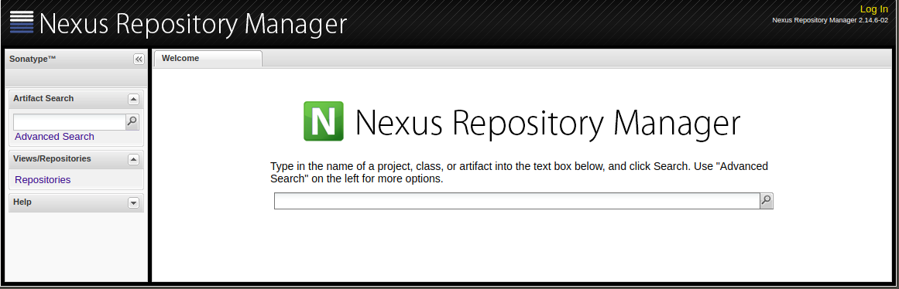

.. _nexus2-guide:

#############
Nexus 2 Guide
#############

Nexus Repository Manager 2 is used by LF projects to store Maven and Java based
artifacts. It helps organizing dependencies and releases.

.. note::

   More information can be found in the Sonatype webpage:
   https://books.sonatype.com/nexus-book/

   And Nexus Repository Manager 2 specifics:
   https://help.sonatype.com/repomanager2

To access Nexus Repository Manager 2 for a particular project, use URL:
``https://nexus.PROJECT_DOMAIN``

Users do not need to login using their LFID credentials. Only LF admin teams and LFRE
engeneers are required to login to access the administator options.
Other users can browse the repositories and proxies openly.

.. image:: _static/nexus2-browse.png
   :alt: Nexus Repository Manager 2 browse view.
   :align: center

Alternately, users can access the repositories outside the GUI using the URL:
``https://nexus.PROJECT_DOMAIN/content/repositories/``

.. image:: _static/nexus2-content.png
   :alt: Nexus Repository Manager 2 content view.
   :align: center

Nexus Repository Manager 2 is connected to Jenkins server which is the interface used to make
the artifacts publications on a scheduled or by demand basis (depending on the Jenkins JJB
configuration for the particuar job).
