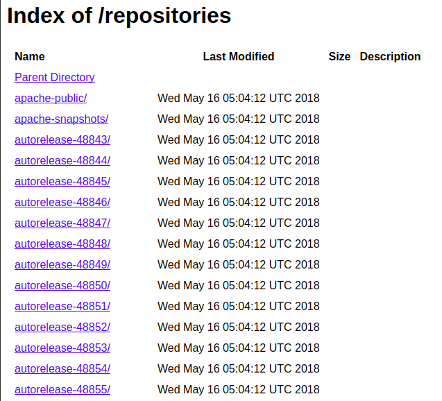

.. _nexus2-guide:

#############
Nexus 2 Guide
#############

LF projects use Nexus Repository Manager 2 to store Maven and Java based artifacts.
It helps organizing dependencies and releases.

.. note::

   And Nexus Repository Manager 2 specifics:
   https://help.sonatype.com/repomanager2

To access Nexus 2 for a particular project, use URL:
``https://nexus.PROJECT_DOMAIN``

.. image:: _static/nexus2-ui.png
   :alt: Nexus Repository Manager 2 main view.
   :align: center

Users do not need to login using their LFID credentials. LF admin teams and LFRE
engeneers should  login to access the administator options.
Other users can browse the repositories and proxies anonymously.

.. image:: _static/nexus2-browse.png
   :alt: Nexus Repository Manager 2 browse view.
   :align: center

Alternately, users can access the repositories outside the GUI using the URL:
``https://nexus.PROJECT_DOMAIN/content/repositories/``

Nexus 2 communicates with Jenkins server which is the interface used to make
the artifacts publications on a scheduled or by demand basis (depending on the Jenkins JJB
configuration for the particuar job).

Nexus 2 Repositories
====================

Nexus 2 allows users to manage different types of repositories. To learn more about
how to manage them, please refer to `Sonatype's official documentation
<https://help.sonatype.com/repomanager2/configuration/managing-repositories/>`_.

Most LF projects manage their Maven artifacts using the following repos:

:Releases: (hosted) Official repository for released artifacts. Releases has a Disabled
    Redeployment policy to avoid overwriting released versions.

:Snapshots: (hosted) Used to publish Maven SNAPSHOT builds. In the project's pom.xml
    these versions have a `-SNAPSHOT` suffix.

Special repo namespaces:

:Public Repositories: (group) A meta-url containing all release repos in a combined view.

:Staging Repositories: (group) A meta-url containing all staging repos in a combined view.
    Beware: oldest staging repo artifacts take precedence in cases where 2 staging repos
    contain the same version artifact.

:Proxy: Repositories that proxy artifacts from an upstream repository.

Each repository is accessible via URL `https://nexus.example.org/content/repositories/<repo name>`.

For continuous integration builds, Jenkins has one settings file for each Gerrit repository.
Each settings file contains an entry for each accessible Nexus2 repository (ServerId).

.. image:: _static/jenkins-settings-files.png
   :alt: Jenkins settings files.
   :align: center

In the Gerrit repository's pom.xml, include the ServerIds in the following manner:

.. code-block:: bash

   <repositories>
       <repository>
           <id>releases</id>
           <name>Release Repository</name>
           <url>${project.nexus.url}/content/repositories/releases/</url>
       </repository>
       <repository>
           <id>staging</id>
           <name>Staging Repository</name>
           <url>${project.nexus.url}/content/repositories/staging/</url>
       </repository>
       <repository>
           <id>snapshots</id>
           <name>Snapshot Repository</name>
           <url>${project.nexus.url}/content/repositories/snapshots/</url>
       </repository>
   </repositories>

.. note::

   More information on access configuration for each Gerrit repository in
   :ref:`Create Nexus2 repos with lftools <create-repos-lftools>`.

.. _create-repos-lftools:

Users and Roles and Privileges
==============================

Official information on creating users and linking roles and privileges to those users, can
be found in Sonatype's official documentation for `users
<https://help.sonatype.com/repomanager2/configuration/managing-users/>`_, and `roles
<https://help.sonatype.com/repomanager2/configuration/managing-roles/>`_.

For LF projects, a user per Gerrit repo is created matching the repo name.

.. image:: _static/nexus-users.png
   :alt: Nexus users.
   :align: center

Similarly, roles and privileges match the name of the repo. Each repo has the following
privileges:

:Repo: All Repositories (Read)
:<project-name>: (create)
:<project-name>: (delete)
:<project-name>: (read)
:<project-name>: (update)

.. image:: _static/nexus-roles.png
   :alt: Nexus roles.
   :align: center

Users get the following roles:

:<project-name>: Which groups the privileges mentioned above.
:Nexus Deployment Role: To deploy into the Snapshots and Releases repositories.
:Staging: Deployer (autorelease) For publishing staging images using the Staging Profile.

.. image:: _static/nexus-privileges.png
   :alt: Nexus privileges.
   :align: center

.. note::

   More information on how users, roles and privileges are created using lftools along with the
   repos in :ref: `Create Nexus2 repos with lftools <create-repos-lftools>`.

Create Nexus2 repos with lftools
================================

.. TODO: Creating Nexus2 repos using lftools (RELENG-954)

