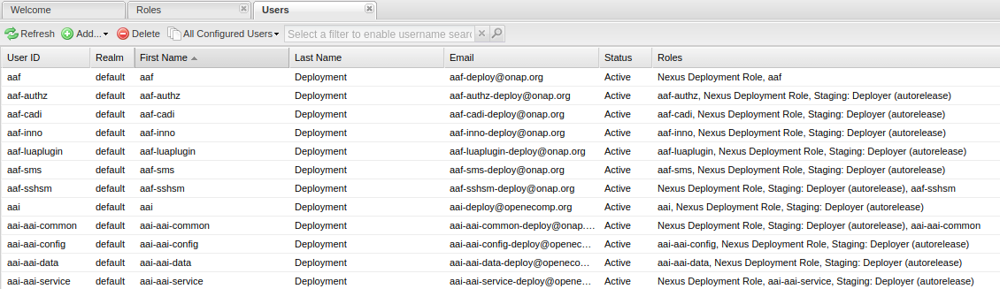
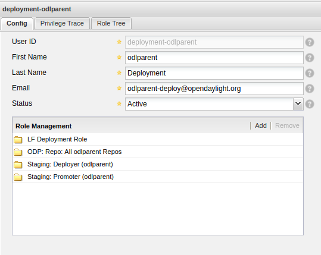

.. _nexus2-guide:

#############
Nexus 2 Guide
#############

LF projects use Nexus Repository Manager 2 to store Maven and Java based artifacts.
It helps organizing dependencies and releases.

.. note::

   And Nexus Repository Manager 2 specifics:
   https://help.sonatype.com/en/repository-manager-2.html

To access Nexus 2 for a particular project, use URL:
``https://nexus.example.org``

.. image:: _static/nexus2-ui.png
   :alt: Nexus Repository Manager 2 main view.
   :align: center

Users do not need to login using their LFID credentials. LF admin teams and LFRE
engeneers should  login to access the administator options.
Other users can browse the repositories and proxies anonymously.

Alternately, users can access the repositories outside the GUI using the URL:
``https://nexus.example.org/content/repositories/``

.. image:: _static/nexus2-content.png
   :alt: Nexus Repository Manager 2 content view.
   :align: center

Nexus 2 communicates with Jenkins server which is the interface used to make
the artifacts publications on a scheduled or by demand basis (depending on the Jenkins JJB
configuration for the particuar job).

Nexus 2 Repositories
====================

Nexus 2 allows users to manage different types of repositories. To learn more about
how to manage them, please refer to `Sonatype's official documentation
<https://help.sonatype.com/en/managing-repositories-in-nexus-2.html>`_.

Most LF projects manage their Maven artifacts using the following repos:

:Releases: (hosted) Official repository for released artifacts. Releases repositories have a
    Disable re-deployment policy to avoid overwriting released versions.

:Snapshots: (hosted) Used to publish Maven SNAPSHOT builds. In the project's pom.xml
    these versions have a `-SNAPSHOT` suffix.

Special repo namespaces:

:Public Repositories: (group) A meta-url containing all release repos in a combined view.

:Staging Repositories: (group) A meta-url containing all staging repos in a combined view.
    Beware: oldest staging repo artifacts take precedence in cases where 2 staging repos
    contain the same version artifact.

:Proxy: Repositories that proxy artifacts from an upstream repository.

Each repository is accessible via URL `https://nexus.example.org/content/repositories/<repo name>`.

For continuous integration builds, Jenkins has one settings file for each Gerrit repository.
Each settings file contains an entry for each accessible Nexus2 repository (ServerId).

In the Gerrit repository's pom.xml, include the ServerIds in the following manner:

.. code-block:: bash

   <repositories>
       <repository>
           <id>releases</id>
           <name>Release Repository</name>
           <url>${project.nexus.url}/content/repositories/releases/</url>
       </repository>
       <repository>
           <id>staging</id>
           <name>Staging Repository</name>
           <url>${project.nexus.url}/content/repositories/staging/</url>
       </repository>
       <repository>
           <id>snapshots</id>
           <name>Snapshot Repository</name>
           <url>${project.nexus.url}/content/repositories/snapshots/</url>
       </repository>
   </repositories>

.. note::

   More information on access configuration for each Gerrit repository in
   :ref:`Create Nexus2 repos with lftools <create-repos-lftools>`.

.. _nexus-users-roles:

Users, Roles and Privileges
===========================

Users, roles and privileges are key to manage and restrict access into Nexus
repositories. Anonymous users have read permissions, while administration teams and CI accounts
have write and delete permissions.

Sonatype's documentation on creating users, roles and privileges found in:
https://help.sonatype.com/en/managing-users.html, and
https://help.sonatype.com/en/managing-roles.html.

For LF projects, a user per Gerrit repository exists matching the repository name.

Similarly, roles and privileges match the name of the Gerrit repository. The following
privileges exist:

* Repo All Repositories (Read)
* <project-name> (create)
* <project-name> (delete)
* <project-name> (read)
* <project-name> (update)

.. note::

   Where "<project-name>" matches the Gerrit name of the repository.

Add roles required for Nexus users:

:<project-name>: Which groups the privileges mentioned above.
:LF Deployment Role: To deploy into the Snapshots and Releases repositories.
:Staging: Deployer (autorelease) For projects using the Staging Profile to create autoreleases.

.. note::

   More information on users, roles and privileges configuration using lftools along with the
   repos in :ref:`Create Nexus2 repos with lftools <create-repos-lftools>`.
