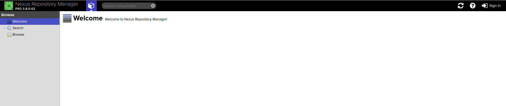
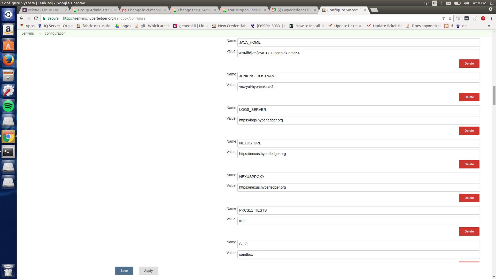
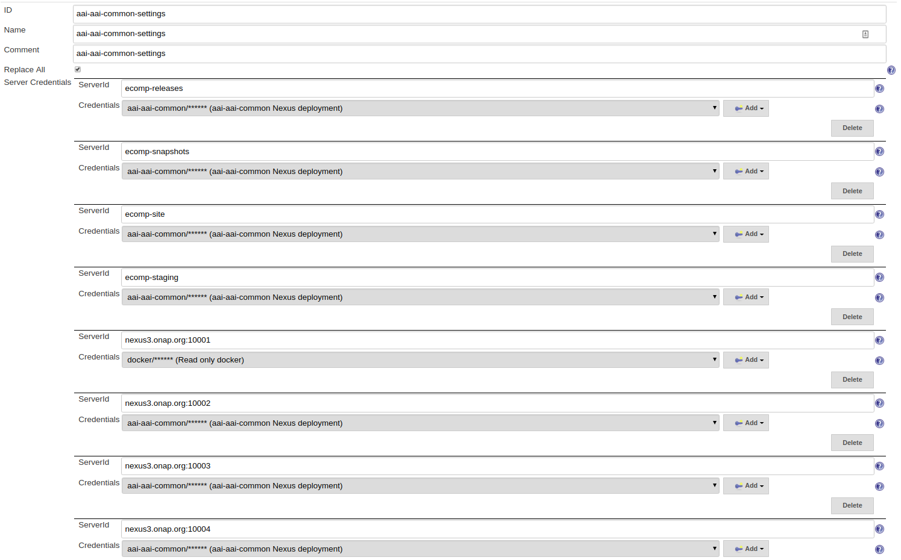
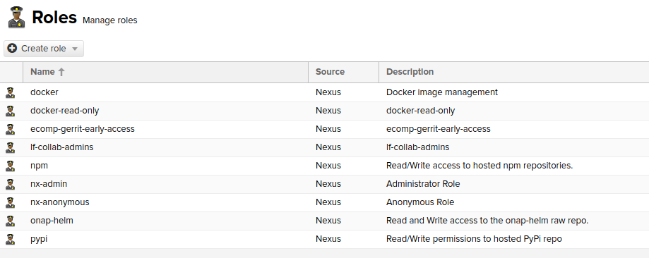

.. _nexus3-guide:

#############
Nexus 3 Guide
#############

LF projects use Nexus Repository Manager 3 to store docker images.
It helps organizing dependencies and releases.

.. note::

   Nexus Repository Manager 3 specifics:
   https://help.sonatype.com/repomanager3

To access Nexus 3 for a particular project, use URL:
``https://nexus3.example.org``

Users do not need to login using their LFID credentials. LF admin teams and LFRE
engineers should  login to access the administrator options.
Other users can browse the repositories and proxies anonymously.

Alternately, users can access the repositories outside the GUI using the URL:
``https://nexus3.example.org/content/repository/<repository-name>/<artifact-path>/<manifest>``

For example:

``https://nexus3.onap.org/repository/docker.snapshot/v2/ecomp/admportal-sdnc-image/manifests/latest``

Nexus 3 communicates with Jenkins server which is the interface used to make
the docker image publications on a scheduled or by demand basis (depending on the Jenkins JJB
configuration for the particular job).

Nexus 3 Repositories
====================

Nexus 3 allows users to manage different types of repositories. To learn more about
how to manage them, please refer to `Sonatype's official documentation
<https://help.sonatype.com/repomanager3/repository-management>`_.

Most LF projects manage their Docker images using the following repos:

:docker.release: (hosted/HTTP port 10002) Official repository for released images.
    Releases repositories have a Disable re-deployment policy to avoid overwriting
    released versions.

:docker.snapshot: (hosted/HTTP port 10003) Used to publish docker snapshot images.

Special repo namespaces:

:docker.public: (group/HTTP port 10001) A meta-url containing all release repos in
    a combined view.

:docker.staging: (hosted/HTTP port 10004) Used to publish docker images produced
    by the scheduled jobs.

:docker.io: Repositories that proxy artifacts from https://registry-1.docker.io.

For continuous integration builds, Jenkins has one settings file for each Gerrit repository.
Each settings file contains an entry for each accessible Nexus3 repository (ServerId).

Fabric8.io plugin usage
-----------------------

Projects using fabric8.io maven plugin for managing their docker images should make
sure to define the docker registries. For example:

.. code-block:: xml

   <docker.pull.registry>nexus3.onap.org:10001</docker.pull.registry>
   <docker.push.registry>nexus3.onap.org:10003</docker.push.registry>

   <groupId>io.fabric8</groupId>
   <artifactId>docker-maven-plugin</artifactId>
   <version>0.19.1</version>
   <configuration>
       <verbose>true</verbose>
       <apiVersion>1.23</apiVersion>
       <pullRegistry>${docker.pull.registry}</pullRegistry>
       <pushRegistry>${docker.push.registry}</pushRegistry>
       <images>
           <image>
               <name>onap/vvp/jenkins</name>
               <alias>vvp-jenkins</alias>
               <build>
                   <cleanup>true</cleanup>
                   <tags>
                       <tag>${docker.tag}</tag>
                       <tag>${docker.latest.tag}</tag>
                   </tags>
                   <dockerFileDir>${project.basedir}</dockerFileDir>
               </build>
           </image>
       </images>
   </configuration>

.. note::

   More information in https://dmp.fabric8.io

Users, Roles and Privileges
===========================

Users, roles and privileges are key to manage and restrict access into Nexus
repositories. Anonymous users have read permissions, while administration
teams and CI accounts have write and delete permissions.

For LF projects, we have created roles to help with the administration of Docker
images, NPM/Pypi/Helm repositories and administrative tasks.

Nexus 3 does not require to define patterns for Repository Targets to allow a
specific directory structure name to exist.

Like Nexus 2, we require to have one user entry per repo in Nexus 3.

Provide the following parameters for every user:

:ID: Should match the Gerrit repository name. For example "aai-aai-common"

:First name: Same as ID

:Last name: We use a generic last name for users, for example "Deployment"

:Email: Repo name + "deploy@example.org". For example "aai-aai-common-deploy@onap.org"

:Status: Active. Can be "Disabled" if the Gerrit repo is no longer in use

:Roles: docker. This role will allow the user to administer Docker images
