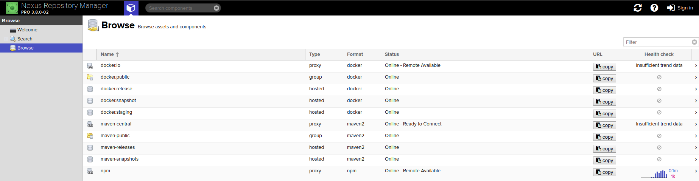

.. _nexus3-guide:

#############
Nexus 3 Guide
#############

LF projects use Nexus Repository Manager 3 to store docker images.
It helps organizing dependencies and releases.

.. note::

   Nexus Repository Manager 3 specifics:
   https://help.sonatype.com/repomanager3

To access Nexus 3 for a particular project, use URL:
``https://nexus3.example.org``

.. image:: _static/nexus3-ui.png
   :alt: Nexus Repository Manager 3 main view.
   :align: center

Users do not need to login using their LFID credentials. LF admin teams and LFRE
engineers should  login to access the administrator options.
Other users can browse the repositories and proxies anonymously.

Alternately, users can access the repositories outside the GUI using the URL:
``https://nexus3.example.org/content/repository/<repository-name>/<artifact-path>/<manifest>``

For example:

``https://nexus3.onap.org/repository/docker.snapshot/v2/ecomp/admportal-sdnc-image/manifests/latest``

Nexus 3 communicates with Jenkins server which is the interface used to make
the docker image publications on a scheduled or by demand basis (depending on the Jenkins JJB
configuration for the particuar job).
